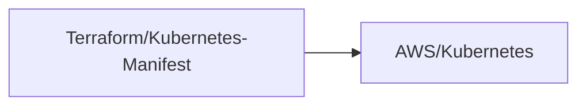
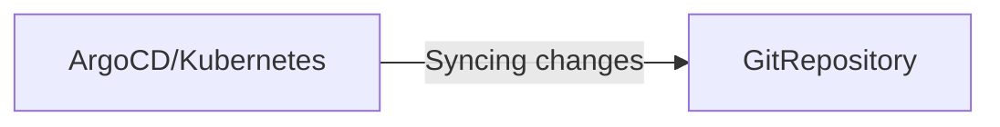
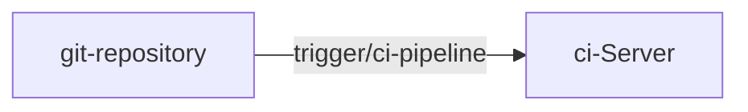
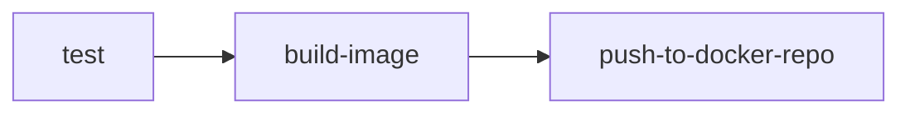
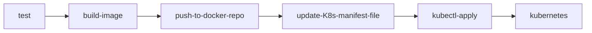
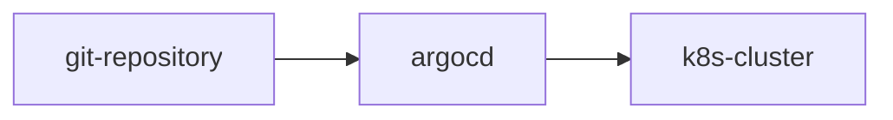

<h1 align="center">GitOps</h1>

<h2>Infrastructure as Code</h2>

- Define Infrastructure as Code instead of creating it manually.
- Infrastructure can be easily reproduced and replicated.
- Infrastructure as Code does not involve just code, but Network as Code, Policy as Code, Configuration as Code and Security as Code. This is the definition about **X as Code**.
- You can unify all of the configurations in the files Terraform and Manifest Kubernetes file. You have a bunch of yaml file.

<h2>Using IaC the wrong way</h2>

<h3>NOT using Git</h3>

- Create and test locally.
- Execute from local machine.

<h3>Store Files in Git Repo</h3>

- Version Control for IaC Files.
- Stored centrally, where everyone has access to it.

<h3>No Review/Approval Process</h3>

- No **Pull Requests** (Merge Requests).
- Commiting directly into Main Branch.
- No **Code Reviews**.
- No **No Collobartion**.
- No **Automated Tests**.

*For all this cases you will the follow problems: Invalid YAML Files, Breaking Infrastructure, Typos and Breaking App Environment.*

<h3>How do you apply these changes ?</h3>

- Infrastructure **Updates** are **not automated**.



- When you execute the code changes, everyone has access to infrastructure.
- If changes come from a local machine, it is hard to trace who excuted.
- If you made some mistake like wrong configuration, you will find mistakes after only once applied.

<h3>Advantage and Disadvantage</h3>

- Advantage: Describing Infrastructure as Code.
- Disadvantage: Manual and Inefficient Process.

<h2>What is GitOps ?</h2>

<p>Treat Infrastructure Code the same as Application Code.</p>

<h2>How does GitOps work ?</h2>

**IaC hosted on Git Repository**

- Version Controlled.
- Team Collaboration.

<h3>GitOps Flow</h3>

1. Create Pull/Merge Request:
    - This will be the same process of application.
2. Run CI Pipeline:
    - Validate Configuration Files.
    - Run Automated Tests.
3. Approve Changes:
    - This could be Developer, Security or Senior Engineering,
    - Tested and Well Reviewed.
4. Run CD Pipeline:
    - Deployed to environment.

*You will have Automated Process, More Transparent and Quality IaC.*

<h2>CD Pipeline: Push vs Pull Model</h2>

<p>When you merge the new configuration in the master branch, changes <strong>automatically applied</strong> to the infrastructure through CD Pipeline. GitOps have two way to applied this chagens what are <strong>Push Deployment</strong> and <strong>Pull Deployment</strong></p>

<h3>Push Deployment</h3>

- It is a tradional pipeline application where have tools like Jenkins and GitLab CI/CD. The application is built and pipeline execute the command to deploy the new application version into the environment.

<h3>Pull Deployment</h3>

- **Agent** installed **in the environment**, e.g. in **K8s cluster** that pull the changes from Git Repository.
- **Monitors** and **Compares** desired state with actual state. If there are difference in the Git Repository, it will pull and applied this chages.
- **Applies** the **Changes** necessary to get to desired state.

*Examples:*

**Flux and Argo CD**

<p>These are examples that work with pull model. They work into the Kubernetes cluster and sync the chages from Git Repository to the cluster.</p>

**IMPORTANT: If you make some mistake you can run a git revert to roll back to any previous state again.**

<h2>Git - Single Source of Truth</h2>

- File are stored centrally on a remote Git Server.
- Environment **always synced** with desired state in the Git Repository.
- This mean that your Git Repository become a Single Source of Truth.



<h2>Increasing Security</h2>

- GitOps also increasing security, because everyone in the team do not have access to change something on infranstructure or directly access to the Kubernetes cluser.
- Only CD Pipeline needs access to deploy the changes.
- Anyone can propose changes through pull request and smaller group of people can approve it and merge the changes.

<h3>Benefits</h3>

- **Less Permissions** to Manage.
- **More Secure** Environment.

<h2>Summarized</h2>

<h3>GipOps is:</h3>

- **IaC**
- **Version Control**
- **Pull/Merge Requests**
- **CI/CD Pipeline**

<h1 align="center">Argo CD</h1>

<h2>What is Argo CD ?</h2>

<p>Argo CD is <strong>C</strong>ontinuos <strong>D</strong>elivery tool.<p>

<h2>With/Without Argo CD</h2>

<h3>CD workflow without Argo CD</h3>

- Let's say that you have some microservices application that are running in the Kubernetes Cluster. When the things change in the code from application, for example: new feature or bugfix committed to Git Repo, the CI Pipeline like Jenkins will automatically trigger and test the changes, after a new docker image will create and push to Docker Repo (Docker hub).



**CI Server (Jenkins)**



*This steps are the Continuos Integration Pipeline.*

**How does it get deployed to K8s cluster ?**

1. Update K8s deployment file with new image tag
2. Apply file in K8s

- After the new image push to Docker Repo, Jenkins will update K8s manifest file for application and use the command kubectl apply to update the deployment file to Kubernetes.



**Challenges with this approach:**

- Install and setup tools, like kubectl. You will need install and config them in Jenkins.
- Configure access to K8s. You will need configure credentials to access Kubernetes in Jenkins.
- Configure access to cloud platforms.
- Security challenge, because you will need to provide your cluster credentials to an external service or tools.
- No visibility of deployment status, Jenkins unknow the Kubernetes status.

<h3>CD workflow with Argo CD</h3>

- Argo CD makes Continuos Delivery for Kubernetes more efficiently and based on GitOps.

**How does Argo CD make the process more efficient ?**

- Argo CD is part of K8s cluster, instead of, it be an external tool that access the K8s cluster like Jenkins.
- Argo CD agent pull K8s manifest changes and applies them.

**CD workflow with Argo CD:**

1. Deploy Argo CD in K8s cluster.
2. Configure Argo CD to track Git repository.
3. Argo CD monitors for any changes and applies automatically.

<p>When the developer applie a commit with changes in Git repository, the Continuos Integration Pipeline (Jenkins) will start the process of test, build image, push to docker repo and update K8s manifest file.</p>

**IMPORTANT: Establish best practice for Git Repository**

- Separate git repository for application source code and application configuration (K8s manifest files)
- Even separate git repository for system configurations.

**Why separate Git Repository ?**

- The main reason for this is K8s manifest can change independent of source code.
- You do not want to trigger the full CI pipeline, when app source code has not changed. 
- You do not want complex logic in CI pipeline.

**K8s manifests can be defined in different ways**

- Argo CD support:
    - Kubernetes YAML Files
    - Helm Charts
    - Kustomize

*Template files that generate K8s manifests.*

<h2>Benefits of using Argo CD</h2>

- Whole K8s configuration defined as Code in Git Repository.
- Config Files are not applied manually from local laptops.
- Same interface for updating the cluster.

<h3>Git as Single Source of Truth</h3>

**What happens if someone updates the cluster manually ?**

- Argo CD watches the chages in the cluster as well.
- Argo CD compares desired configuration in the Git repo with the actual state in the K8s cluster.
- If someone goes and make change manually in cluster Argo CD will detect states diverged, because it will see the difference between actual state and desired state.
- Argo CD will sync the changes, overwriting the manual change.

*Guarantes that K8s manifests in Git remains single source of truth.*

**Need a way to quickly update the cluster anyway ?**

- Configure Argo CD to not sync manual cluster changes automatically.
- Send alert instead.

<h2>Easy Rollback</h2>

- If a commit break something in K8s cluster, git revert can be execute to roll back to any previous state.
- No need to manually revert every update in the cluster.

**Imperative**

- step by step instructions how to revert.

**Declarative**

- declare your desired end state.

<h2>Cluster Disaster Recovery</h2>

- If I have an Amazon EKS and the K8s cluster completely crashes, I can create a new K8s cluster and point it to the Git Repository, where the complete configuration is define and this will recreate the same state of previous one.

**GitOps**

- Benefits you get with GitOps in general.
- Argo CD is based on GitOps and helps implement those GitOps principles.

<h2>K8s Access Control with Git</h2>

- Not everyone should have access to K8s cluster.
- Configure Access Rules easily with Git repositories.
- Manage Cluster Access indirectly via Git.
- No need to create ClusterRole & User resources in Kubernetes.

<h2>K8s Access Control with Argo CD</h2>

- You don't need to give external cluster access to non human users.
- No cluster credentials outside of K8s.

*This make manager credentials in K8s more easy.*

<h2>Argo CD as K8s extension</h2>

<h3>What does that mean ?</h3>

- Argo CD uses existing K8s functionalities for doing his job.
- E.g using etcd to store data.
- E.g using K8s controllers for monitoring and comparing actual and desired state.

<h3>Benefit of that ?</h3>

- Visibility in the cluster:
    - Real-time updates of application state.
    - Argo CD can monitoring deployment changes after the application was deploy.



- Argo CD makes sure that these 2 are always in sync.
 
<h2>Configure Argo CD</h2>

<h3>How to configure Argo CD ?</h3>

1. Deploy Argo CD into K8s cluster:
    1.1. Extends the K8s API with Custom Resource Definition.
2. Configure Argo CD with K8s YAML File.
    - Main Resource is "Application".
      - In the middle of application.yaml file you will have which git repository and K8s cluster must be define.
    - You can configure multiples applications for different microservices in your cluster. If the applications belong together, you can group them.

<h2>Multiple Clusters with Argo CD</h2>

<h3>Argo CD & Multi-Cluster Setups ?</h3>

**Working with multiple clusters**

<p>You have each K8s configured in different regions and one of them has an Argo CD. So, you can configure and manage just 1 Argo CD and the same Argo CD instance is able to sync a fleet of K8s clusters.</p>

**Multiple cluster environments ?**

<p>If you have multiple cluster environments as development, staging and production, but you do not want to deploy it to all envronments at once, you can have the follow options:</p>

1. Git branch for each environment:
    - You will have development, staging and production branch.
2. Using overlays with kustomize:
    - You will have own context for each environment and overlays reuse the same base yaml files and then selectively changes specific part for different environment.

<h2>Replacement for other CI/CD tools ?</h2>

- Argo CD does not replace other CI/CD tools like Jenkin, for example. We stil need CI pipeline, becausa Argo CD work with flow of CD pipeline. So, Argo CD is a replace for Conitnuous Delivery and specifically for Kubernetes.

<h3>Argo CD alternatives</h3>

**GitOps CD tools for Kubernetes**

- Flux: He implement the same flow of Git Ops CD and him also is popular.

<h2>Demo Overview</h2>

1. Install Argo CD in K8s cluster.
2. Configure Argo CD with "Application" CRD:
    - In this step we will track and sync Git Repository with Argo CD.
3. Test our setup by updating Deployment.yaml file.

<h2>Install Argo CD in K8s cluster</h2>

1. Install Argo CD in K8s cluster:
> https://argo-cd.readthedocs.io/en/stable/getting_started/
2. Access Argo CD UI:
```bash
kubectl get secret argocd-initial-admin-secret -n argocd -o yaml
echo [PASSWORD] | base64 --decode
```
- This command is used to get the Argo CD password.
- Use `base64 --decode` to see the password.

<h2>Configure Argo CD</h2>

1. Create a file `application.yaml` and put the configurations of Argo CD into the file.

> https://argo-cd.readthedocs.io/en/stable/operator-manual/application.yaml

- This application.yaml file will create an application in the same namespace of argocd.
```yaml
metadata:
  name: myapp-argo-application
  namespace: argocd
```

**IMPORTANT: Take a look the apiVersion always, because it can change soon.**

- To list the namespace with command `kubectl`, you can use the follow it:
```bash
kubectl get ns
```

**Argo CD will poll Git repository every 3 minutes to check if there is changes.**

<h3>Get rid of the delay ? </h3>

<p>If you don't want this delay, you can <strong>configure a Git webhook</strong>.</p>

- To apply the configuratio you need to run the follow command:
```bash
kubectl apply -f application.yaml
```

**REFRESH: Compare the latest code in Git with live state.**

**SYNC: Move to target state, by actually applying the changes to the K8s cluster.**